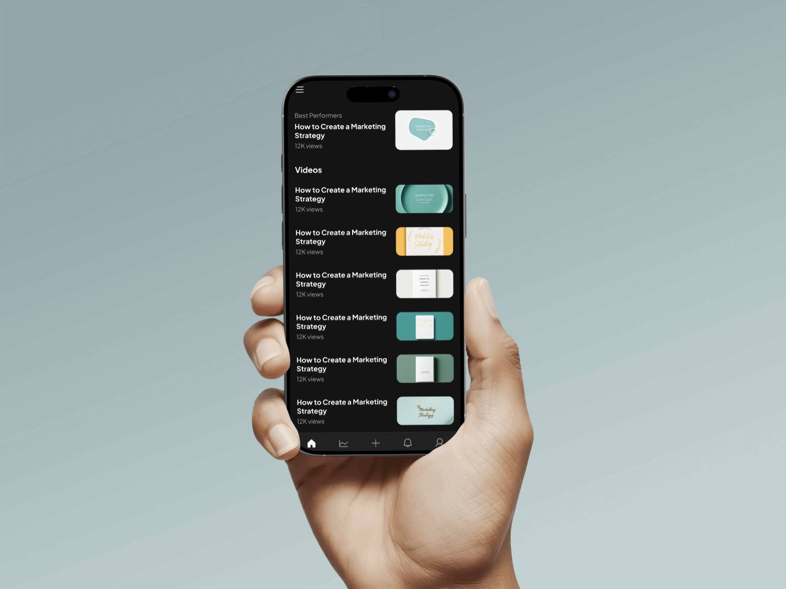
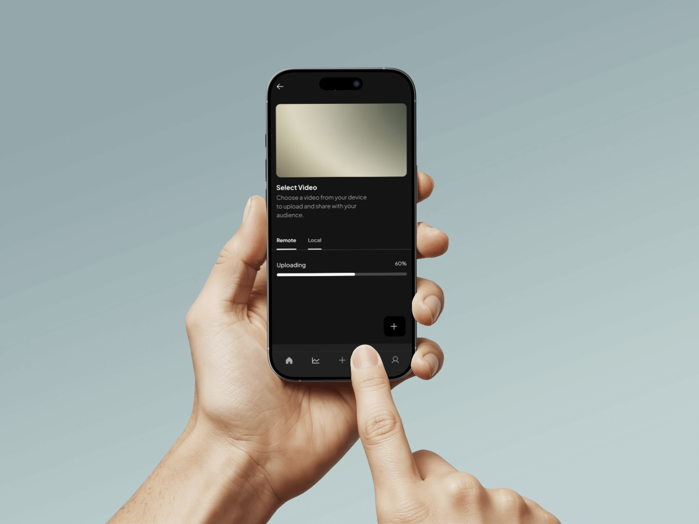
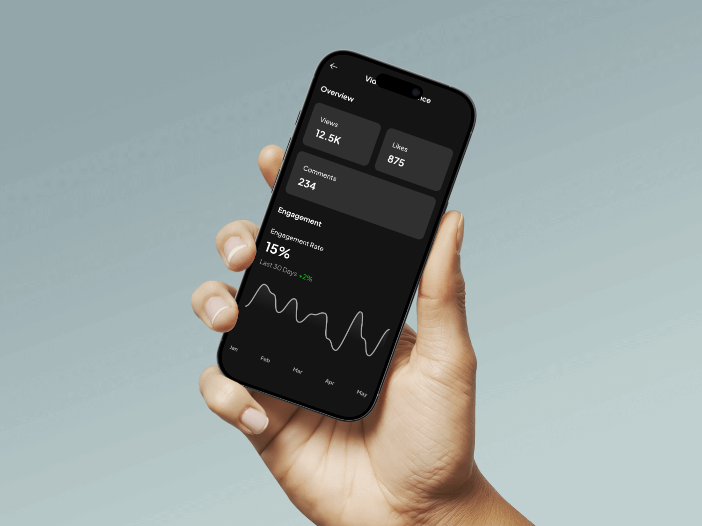
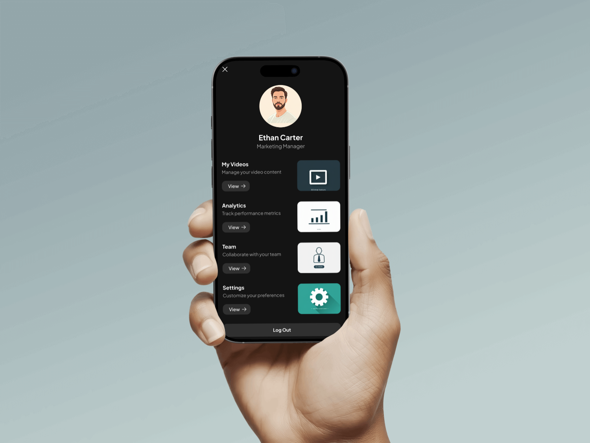

# WLOG - AI-Powered Content Management Platform

A sophisticated Flutter mobile application for marketing teams to create, manage, analyze, and collaborate on digital content. Originally developed for SOFINDEX client requirements, this is the fully re-implemented version as a personal portfolio project showcasing advanced mobile development capabilities.

---

## 📖 Table of Contents

1. [About the Project](#about-the-project)
2. [Features](#features)
3. [AI Integration](#ai-integration)
4. [Media](#media)
5. [Tech Stack](#tech-stack)
6. [Architecture](#architecture)
---

## 📝 About the Project

WLOG is a comprehensive content management platform built with Flutter, designed to revolutionize how marketing teams handle their digital content workflows. The application combines modern UI/UX design with cutting-edge AI technology to provide:

- **AI-Powered Analytics** with performance insights and trend analysis
- **Real-time Collaboration** through WebSocket-powered team chat
- **Cross-platform Compatibility** (iOS, Android, Web, Desktop)
- **Modern Dark-themed UI** with vibrant gradient accents and smooth animations
- **Enterprise-grade Architecture** with clean code principles and scalability

---

## ✨ Core Features

### 🔐 **Authentication & User Management**
- Secure authentication with Supabase Auth
- Animated splash screen with gradient logo transitions
- Form validation and comprehensive error handling
- Session management with auto-login capabilities

### 📊 **Content Management System**
- Multi-platform content upload (mobile, web, desktop)
- Rich text editor with real-time preview
- Tag-based categorization and filtering
- Responsive grid layouts (3/2/1 columns based on screen size)
- Content validation and optimization suggestions

### 📈 **AI-Powered Analytics Dashboard**
- Performance analysis using Gemini AI and GPT-4 Vision
- Real-time social media trend scraping and correlation
- Content quality assessment with confidence scoring
- Competitive analysis and benchmarking
- Interactive charts and performance metrics visualization

### 💬 **Real-Time Team Collaboration**
- WebSocket-powered chat system using Supabase Realtime
- Category-based chat groups for organized communication
- Message threading with status indicators
- Pull-to-refresh functionality for seamless updates
- Cross-platform message synchronization

### 👤 **Profile & Settings Management**
- Comprehensive user profile with content statistics
- Navigation to personal content, analytics, and team features
- Theme switching (dark/light mode) with system preference detection
- Secure logout with confirmation dialogs

---

## 🤖 AI Integration

### **Advanced Content Analysis**
- **Image Analysis**: Gemini AI for content extraction, theme detection, and technical assessment
- **Trend Scraping**: Real-time social media trend analysis with engagement metrics
- **Performance Prediction**: ML-based content performance forecasting
- **Smart Recommendations**: AI-generated optimization suggestions based on current trends
- **Intelligent Caching**: Performance analysis caching with force refresh capabilities

### **Fallback Systems**
- Multiple AI service integration with automatic fallback
- Offline-capable analysis with local processing
- Error handling with graceful degradation
- Confidence scoring for analysis reliability

---

## 📸 Media

### Logos
     

### Splash Screen
 

### Dashboard
  

### Upload Flow
 

### Analytics

### Profile

---

## 🛠️ Tech Stack

### **Frontend Development**
- **Flutter & Dart**: Cross-platform mobile development
- **BLoC Pattern**: Reactive state management with flutter_bloc
- **Clean Architecture**: Separation of concerns with repository pattern
- **Custom Theme System**: Dark/light mode with gradient accents
- **Responsive Design**: Adaptive layouts for all screen sizes

### **Backend Infrastructure**
- **Supabase**: Backend-as-a-Service with PostgreSQL
- **Real-time Database**: WebSocket connections for live updates
- **Authentication**: Secure user management with Supabase Auth
- **File Storage**: Multi-platform file upload and management
- **Environment Configuration**: Secure API key management with dotenv

### **AI & Analytics**
- **Gemini AI API**: Advanced image analysis and content generation
- **Custom Algorithms**: Trend scraping and performance analysis
- **Caching System**: Intelligent analysis result caching
- **Fallback Strategies**: Multiple AI service integration

### **Key Dependencies**
- `flutter_bloc`: State management and reactive programming
- `supabase_flutter`: Backend integration and real-time features
- `fpdart`: Functional programming with Either pattern
- `get_it`: Dependency injection container
- `image_picker`: Cross-platform media selection
- `flutter_dotenv`: Environment variable management

---

## 🏗️ Architecture

### **Clean Architecture Principles**
- **Presentation Layer**: BLoC pattern for state management
- **Domain Layer**: Business logic with use cases and entities
- **Data Layer**: Repository pattern with remote and local data sources
- **Dependency Injection**: Service locator pattern with GetIt

### **Design Patterns**
- **Repository Pattern**: Data abstraction and testability
- **Use Case Pattern**: Single responsibility business logic
- **BLoC Pattern**: Reactive state management
- **Either Pattern**: Functional error handling with FPDart

### **Performance Optimizations**
- **Lazy Loading**: Efficient memory management
- **Image Caching**: Optimized media loading
- **Database Indexing**: Fast query performance
- **Real-time Connection Management**: WebSocket optimization
- **Smart Caching**: AI analysis result caching

---

## 🚀 Getting Started

### **Prerequisites**
- Flutter SDK (3.0+)
- Dart SDK (3.0+)
- Supabase account and project setup
- Gemini AI API key

### **Installation**
1. Clone the repository
2. Install dependencies: `flutter pub get`
3. Configure environment variables in `.env`
4. Set up Supabase project and database schema
5. Run the app: `flutter run`

---

## 📱 Platform Support
- ✅ **iOS** (iPhone & iPad)
- ✅ **Android** (Phone & Tablet)
- ✅ **Web** (Progressive Web App)
- ✅ **Desktop** (Windows, macOS, Linux)

---

## 🎯 Project Highlights

**Originally developed for SOFINDEX client requirements, then fully reimplemented as a personal portfolio project to demonstrate:**

- Advanced Flutter development capabilities
- Modern mobile app architecture patterns
- AI integration and real-time systems
- Cross-platform development expertise
- Enterprise-grade code quality and scalability

---

*This project showcases comprehensive mobile development skills, from UI/UX design to backend integration, AI implementation, and real-time features - all built with industry best practices and clean architecture principles.*
